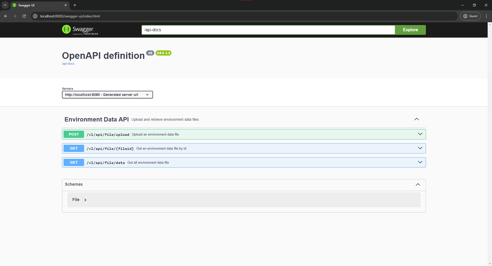

add## Overview

This is a RESTful API developed for Enviro365, a leading environmental consulting firm. The API facilitates file data
processing for clients, enabling them to upload text files containing environmental data for analysis, retrieve
processed results through simple API requests, and save the data in the database.

## Technology Stack

- Java (17+)
- Spring Boot
- Maven
- H2 Database (In-memory)
- JUnit 5
- Mockito
- Swagger
- Lombok

## Setup and Installation

1. Ensure you have Java 17 and Maven installed on your machine.
2. Clone the repository to your local machine.
3. Navigate to the project directory and run the command `mvn clean install` to build the project.
4. Run the command `mvn spring-boot:run` to start the application.

## API Endpoints

The API consists of several endpoints to facilitate file upload, data processing, and retrieval of processed results.
Detailed documentation for each endpoint, including request and response formats, will be provided in the subsequent
sections.

### Get an environment data file by id

- Method: GET
- Path: `/v1/api/file/{fileid}`
- Parameters: `fileid` (path parameter)
- Response: A `File` object

### Get all environment data files

- Method: GET
- Path: `/v1/api/file/data`
- Response: A list of `File` objects

### Upload an environment data file

- Method: POST
- Path: `/v1/api/file/upload`
- Parameters: `file` (form data)
- Response: A string message indicating the upload status

## Error Handling

The application has a global exception handler that handles all exceptions thrown by the application. It returns a
response with an appropriate HTTP status code and a message describing the error.

- `FileProcessingException`: This exception is thrown when there is an error processing a file. It returns a 500
  Internal Server Error status code.
- `FileStorageException`: This exception is thrown when there is an error storing a file. The status code depends on the
  error message:
    - "File is empty, please upload a text file with contents": 400 Bad Request
    - "File is too large, please upload a file smaller than 500kb.": 413 Payload Too Large
    - "Please upload a text file.": 415 Unsupported Media Type

## Database

The application uses an in-memory H2 database for storing data. The data in the database is temporary and will be lost
when the application is stopped.

## Testing

"ROBUST" Unit tests have been written to ensure the functionality, reliability, and performance of the API endpoints. To
run the
tests, navigate to the project directory and run the command `mvn test`.

### Test Coverage

The tests cover a variety of scenarios, including:

- Uploading an empty file
- Uploading a large file
- Uploading a non-text file
- Retrieving a file by its ID
- Retrieving all files

##NOTE

Upload File Request:
When using postman to test the API, please ensure that the file is uploaded as form-data with the key `file`.
The header should be set to `Content-Type: multipart/form-data`.

Get file by id:
When using postman to test the API, please ensure that the file id is passed as a path parameter in the URL.
When using postman ensure that the Headers are set to `Content-Type: application/json`

Get all data files
When using postman ensure that the Headers are set to `Content-Type: application/json`

